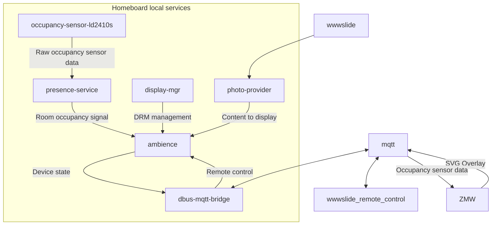

# Homeboard

V2 of my [picture frame + home board](https://nicolasbrailo.github.io/blog/projects_texts/24homeboard.html)


Homeboard is a project to display pictures and an arbitrary SVG overlay with information through a PoE picture frame (you can see above my creative attempt at hiding the ethernet cable run with some decorations).

- On startup, connects to [wwwslide](https://github.com/nicolasbrailo/wwwslide) to retrieve images. The device is mostly stateless, no need to pre-provision pictures or config (just the software, until I make it bootable over LAN).
- Connects to an MQTT broker for remote-control. [wwwslide](https://github.com/nicolasbrailo/wwwslide) provides a remote-control interface.
- Displays pictures, but only when you are around. It has a presence sensor so that the screen will turn off when no one is there to see the pictures (bonus: you can use this as an overcomplicated presence sensor for home automation over MQTT).
- Integrates with [ZMW, my home automation project](https://github.com/nicolasbrailo/zmw/tree/main/zmw_homeboard). ZMW can push an SVG overlay, which I am using to show the weather, announcements and a QR code for the remote control URL.

wwwslide's remote control looks like this


## Dependencies

Homeboard's software uses a set of services that talk over dbus. If you have a different motion sensor, for example, replace the occupancy-sensor-ld2410s service with your own integration -but keep the dbus signals the same- and everything should just work. Likewise, you can change the photo-provider service and integrate with a different photo provider service.



## Bill of materials

- A panel. I got an N173FGE-E23.
- An HDMI to eDP driver. I found one that [works out of the box](https://www.aliexpress.com/item/32968710965.html) with an N173FGE-E23.
- A PoE adapter. I recommend one with 12v output to feed the eDP driver, but you can also make it work with a 5v output and a boost converter ([I found this to be less stable](https://nicolasbrailo.github.io/blog/2026/0423_HomeboardN1.html)).
- A boost (or buck) converter, depending on your PoE adapter either 12v->5v or 5v->12v. Also get a few 1000uF capacitors for both sides of the converter.
- [Optional] an [eInk display](https://www.waveshare.com/wiki/2.13inch_e-Paper_HAT_Manual).
- An mmWave sensor. I got an HLK-LD2410S 24G. You can, of course, replace it (for example with a PIR) as long as you adapt the presence-service.
- Raspberry Pi Zero (no W, if you're using a PoE wireless is not needed). Ideally, install an L-shaped GPIO header. This will make fitting the assembly in the tight space of the picture frame much simpler: there is plenty of horizontal space, but very little vertical clearance.
- A ton of cables, M2.5 screws and duct tape.

## Build

You will need a picture frame. ./mount-designs has an option for a laser engraver; it consists of a main board to mount all of the circuits, and a frame panel, to mount the display to an Ikea picture frame. If using this, make sure your build is as flat as possible, as there isn't more than 20mm of space to play with (eg caps should be as horizontal as possible).

The wiring itself is simple, just plug whatever fits together. Here are two examples, one using the laser cut board and another using a pizza box:


The only fiddly bits are the GPIO connections:

1. For eInk wiring, check [the eInk's utility README](./eink-write/README.md); you can change wiring, but you will need to update the pins (which are hardcoded in C today)
1. For mmWave sensor wiring, check [the occupancy sensor's README](./occupancy-sensor-ld2410s/README.md)
1. Recommended: [add capacitors to any voltage converter you have](https://nicolasbrailo.github.io/blog/2026/0423_HomeboardN1.html), especially if you are working close to the power limit of the system.

You will need an [Raspberry Pi pinout](https://images.theengineeringprojects.com/image/webp/2021/03/raspberry-pi-zero-5.png.webp) reference.


## OS setup

1. Install Raspberry Pi OS as usual.
1. Headless setup: write echo "batman:`echo 'mypassword' | openssl passwd -6 -stdin`" > bootfs/userconf.txt (or maybe rootfs? Try both just in case)
1. Also `touch bootfs/ssh` and `touch rootfs/ssh`
1. After bootup, ssh should be available
1. Set up ssh pub keys `ssh-copy-id batman@$IP`
1. Convenience tools: `sudo apt install vim tmux`
1. Groups you'll need: `sudo usermod -aG dialout,sudo,video,users,gpio,spi,systemd-journal $USER`
1. Configure UART for mmWave sensor:
    - Add `enable_uart=1` and `dtoverlay=disable-bt` to /boot/firmware/config.txt
    - Disable services that try to use UART: `sudo systemctl disable --now serial-getty@ttyAMA0.service serial-getty@serial0.service` and `sudo systemctl disable --now hciuart`
    - Remove any `console=serial*` from cmdline
    - `sudo raspi-config nonint do_spi 0`
    - Alternatively, run all of these from `make -C occupancy-sensor-ld2410s config-target`
1. Optional: add `export PATH=$PATH:/home/$USER/homeboard/bin` to bashrc
1. Install project deps not statically linked in: `sudo apt install libmosquitto1`
1. Disable GUI:
```
sudo systemctl set-default multi-user.target
sudo systemctl disable lightdm
sudo rm /etc/systemd/system/getty@tty1.service.d/autologin.conf
sudo systemctl daemon-reload
sudo reboot
```
1. Make bootup faster, disable services we won't use:
```
sudo systemctl disable --now bluetooth.service wpa_supplicant.service
sudo systemctl disable --now lightdm.service
sudo systemctl disable --now plymouth-start.service plymouth-quit-wait.service
sudo systemctl disable --now glamor-test.service
sudo systemctl disable --now accounts-daemon.service
sudo systemctl disable --now packagekit.service
systemctl disable --now cloud-init-main cloud-init-local cloud-config cloud-final
sudo touch /etc/cloud/cloud-init.disabled
```

The target OS should now be ready to deploy xcompiled binaries:

## Project build

In the build machine:

1. Set up deps: `sudo apt-get install build-essential clang clang-format gcc-arm-linux-gnueabi gcc-arm-linux-gnueabihf`
1. Ensure common.mk has xcompile target (if not building locally) and setup the target IP in DEPLOY_TGT_HOST. Also update IP in root Makefile.
1. Build test project: `cd xcompile-test && make && file build/xcompile-test`
1. `make deploy` will deploy the entire project to the target, and it will install configs and dbus policies, but no systemd targets.
1. You may need to let display-mgr run as non root: `sudo setcap cap_sys_admin+ep build/homeboard-display-mgr`

At this point, before installing systemd units, it's a good idea to test if services run as expected, and if all GPIO connections are set up properly. For this, you can launch each of the services in a tmux pane:

- homeboard-display-mgr; this will control the DRM
- homeboard-photo-provider; provides new pictures to the ambience service
- homeboard-occupancy-sensor-ld2410s; interfaces with mmWave sensor
- homeboard-presence-service; a layer on top of the occupancy sensor to determine when a person is close or not
- homeboard-dbus-mqtt-bridge; external MQTT interface to Homeboard
- homeboard-ambience; main slideshow, overlays, eInk management

If everything goes well, the target `make install-systemd` can install each service. Reboot to make sure nothing breaks.


## TODOs and known bugs

- Make the eInk pins runtime config instead of hardcoded in C
- eInk: verify why partial update isn't working
- if eInk fails on startup then we never recover -> we should retry a few times, or crash and let systemd handle
- eInk display layout is not great, often misses the last letter
- Need to handle ENOTCONN for photo client, the bus may disconnect when retrieving a picture (check: any other risky call sites for ENOTCONN?)

